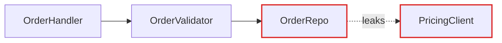

# Markdown Report Format

The architectural review is a single Markdown note in the vault. It has to read well in two places: Obsidian, where the user browses it, and a terminal, where an agent reads it back later. Both render Mermaid and both render monospace blocks, so those are the two visual tools — no CDN, no HTML, no build step.

Two visual registers, used for different jobs:

- **Mermaid** for anything graph-shaped: call flow, dependencies, sequence, the collapse of a call tree. Mermaid lays these out for you and gets it right.
- **ASCII depth-boxes** for mass and depth — the interface-vs-implementation proportion. Mermaid cannot draw this with the right weight; a monospace box can, and it matches the boxes already in `codebase-design`'s SKILL.md, so the two documents look like one system.

Don't reach for Mermaid on everything — a page of identical flowcharts reads as generic.

## Note scaffold

```markdown
---
title: Architecture Review — <repo name>
tags: [architecture, review, <project-tag>]
created: <YYYY-MM-DD>
repo: <path to the repo>
---

# Architecture Review — <repo name>

**Scope:** <what you looked at, and why — the hot spots, or the direction the user named>
**Legend:** solid box = module · dashed line = seam · `!` = leakage across a seam · thick box = deep module

## Candidates

<one `###` block per candidate>

## Top recommendation

<one short block: which candidate first, and why. Wikilink to nothing else — it's the same note.>
```

No introduction paragraph. Straight into the candidates.

## Candidate block

The diagrams carry the weight. Prose is sparse, plain, and uses the glossary terms without ceremony.

```markdown
### Collapse the Order intake pipeline

`Strong` · `local-substitutable`

**Files:** `src/orders/handler.ts`, `src/orders/validator.ts`, `src/orders/repo.ts`

**Problem:** one sentence. What hurts.

**Solution:** one sentence. What changes.

#### Before

<diagram>

#### After

<diagram>

**Wins**
- locality: bugs concentrate in one module
- leverage: one interface, 14 call sites
- interface shrinks; implementation absorbs three wrappers

> [!warning] Contradicts ADR-0007
> …but worth reopening because <reason>. Reopening means a new superseding ADR, not an edit.
```

**Badges are text**, as inline code on one line under the title:

- Strength — `Strong`, `Worth exploring`, or `Speculative`
- Dependency category — `in-process`, `local-substitutable`, `ports-and-adapters`, or `mock`

**No paragraphs of explanation.** If a diagram needs a paragraph to be understood, redraw the diagram. Wins bullets are six words or fewer.

## Diagram patterns

Pick the pattern that fits the candidate, and mix them across the report.

### Mermaid flowchart — the workhorse for dependencies and call flow

Use when the point is "X calls Y calls Z, and look at the mess." Colour leaking edges red and the deep module dark.

````markdown

````

The "after" is the same flowchart with the collapsed modules inside a `subgraph` — Obsidian draws the enclosing border, which reads as the new module's interface.

### Mermaid sequence — for round-trip counts

Good when the win is "before: six round-trips; after: one."

### ASCII depth-boxes — for mass and depth

The interface-vs-implementation proportion. Reuse the exact box style from `codebase-design`:

```
BEFORE — three shallow modules            AFTER — one deep module

┌───────────────────────────┐             ┌─────────────────────┐
│   Large Interface (×3)    │             │   Small Interface   │
├───────────────────────────┤             ├─────────────────────┤
│  Thin Implementation      │             │                     │
└───────────────────────────┘             │  Deep Implementation│
                                          │                     │
                                          └─────────────────────┘
```

The proportions are the argument — a wide-interface/thin-body box next to a narrow-interface/tall-body box says "shallow → deep" without a caption.

### ASCII cross-section — for layered shallowness

Stack bands to show the layers a call passes through. Before: six thin layers each doing nothing. After: one thick band with the consolidated responsibility.

```
BEFORE                          AFTER
──── handler ────               ┌────────────────────┐
──── validator ──               │   Order intake     │
──── mapper ─────               │  (validate, map,   │
──── repo ───────               │   persist, price)  │
──── pricing ────               └────────────────────┘
```

### Mermaid call-graph collapse

Before: the tree of function calls. After: the same tree inside one `subgraph`, with the now-internal calls still visible but enclosed. Seeing the calls survive *inside* the boundary is the point — deepening hides them from callers, it doesn't delete them.

## Top recommendation

One short block: the candidate name, one sentence on why it goes first, and a link to its heading (`[[#Collapse the Order intake pipeline]]`). That's it.

## Tone

Plain English, concise — but the architectural nouns and verbs come straight from `codebase-design`. Concision is not an excuse to drift.

**Use exactly:** module, interface, implementation, depth, deep, shallow, seam, adapter, leverage, locality.

**Never substitute:** component, service, unit (for module) · API, signature (for interface) · boundary (for seam) · layer, wrapper (for module, when you mean module).

**Phrasings that fit:**

- "Order intake module is shallow — interface nearly matches the implementation."
- "Pricing leaks across the seam."
- "Deepen: one interface, one place to test."
- "Two adapters justify the seam: HTTP in prod, in-memory in tests."

**Wins bullets** name the gain in glossary terms: *"locality: bugs concentrate in one module"*, *"leverage: one interface, N call sites"*. Don't write *"easier to maintain"* or *"cleaner code"* — those aren't in the glossary and don't earn their place.

No hedging, no throat-clearing, no "it's worth noting that…". If a sentence could be a bullet, make it a bullet. If a bullet could be cut, cut it. If a term isn't in the `codebase-design` glossary, reach for one that is before inventing a new one.

## Vault conventions

The note is read by a human in Obsidian, not only by agents.

- **Wikilink to the project's other notes** — the spec, the map, the tickets a candidate would become. Plain paths for anything in the repo, since code files aren't vault notes.
- **Match the surrounding frontmatter** rather than imposing a new scheme.
- **Don't reorganise the project folder.** Add the review note; leave everything else alone.
- Follow the tracker's **draft → confirm → write** gate: show the user the note and the exact path before writing it.
